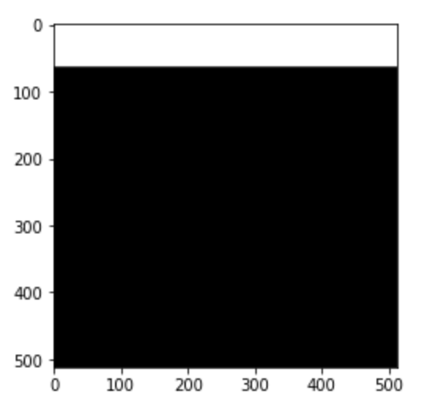
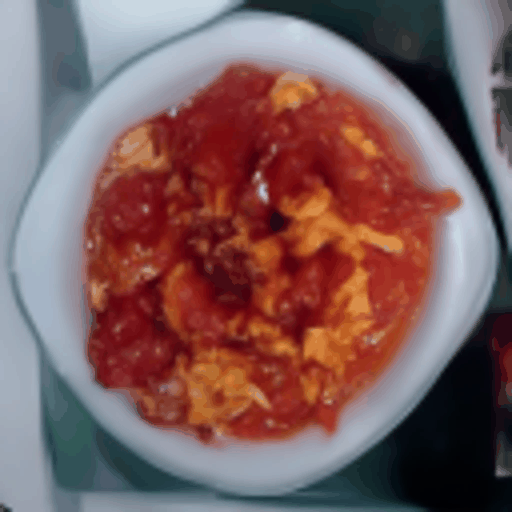
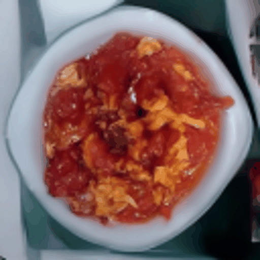
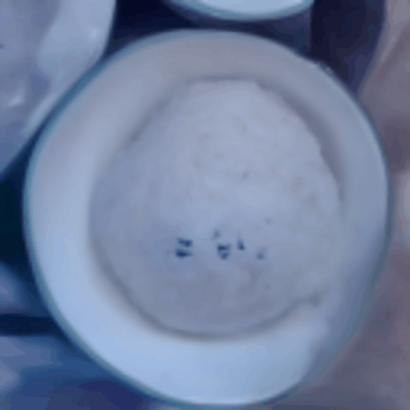
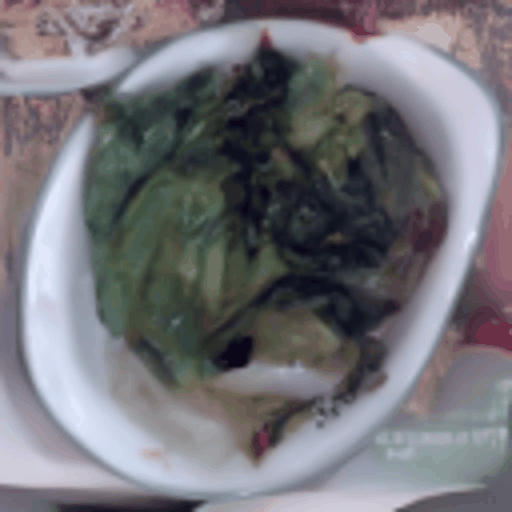

# **easy_diffusion**
*Easy diffusion是一个易于训练和修改的基于diffusion的模型，它是我在通读diffusion系列论文和相应代码的基础上开发的一个文本生成模型。我做这个项目的原因有两个：第一，公司的业务有一个垂直中文领域的文本生成需求，所以需要训练一个适用于这个领域的文本生成模型；第二，目前开源的diffusion模型代码已经非常完善，但是对于像我这样想要自定义修改的用户来说，修改代码会比较麻烦，因为那些代码基本上都已经在config文件中定义好了模型架构和训练流程。因此，我总结和设计了Easy diffusion，它的代码完全由基础的dataset、dataloader、模型架构和diffusion步骤组成。本项目的代码更多的是给读者理解如何从头开始构建一个diffusion模型，所以并没有实现成可安装的形式。

其中ipynb下面有每个模型详细的训练和模型推理的流程，感兴趣的朋友可以按照这个流程试一试，感觉做的还行的朋友麻烦点个star，有不足的地方还请大家指出。
*


# **什么是diffusion** 
diffusion本质上就是首先通过给原图加噪声破坏图片，然后根据输入的图片和timestep建模，来拟合加入了多少的噪声，由于加入多少的噪声很难通过解析解获得，所以基本上都是构建神经网络来拟合。逆diffusion即denoising过程就是从随机的噪声根据建模得到的模型，迭代求解出原图。DDPM的sample步骤基本就是diffuion的逆步骤，而DDIM根据ODE公式的推导，可以对sample步骤进行跳步，加速图片的生成。
 

## **Requirements**
pytorch, cn_clip, sd-v1-5-inpainting
Easy diffusion需要pytorch、cn_clip和sd-v1-5-inpainting三个模块。其中，cn_clip用于将中文菜品名编码成嵌入向量，在我的项目中，我使用微调过的cn_clip；Easy diffusion则使用diffusion模块进行条件和非条件文本生成；sd-v1-5-inpainting用于图像修复

## **代码说明**
见code_detail.md

## **How To Train and Sample**
Easy diffusion的实现流程代码和代码使用的方法都在easy_diffusion/ipynb的Jupyter文件中，包括数据预处理、模型训练和模型推理等。
### *数据集的准备和处理*
由于easy_diffusion是一个用于生成文生动图的模型，所以需要准备一些包含文本和图像的数据集。数据集的处理可以分为以下几个步骤：
收集中文文本和相应的图片数据集
对中文文本进行分词、编码，得到中文文本的embedding表示
对图片进行预处理，如调整大小、裁剪等操作
将中文文本embedding和图片数据对应起来，组成可以用于模型训练的数据集
将你收集到的数据实现为一个dataset文件，具体格式可以参考aiposdataset.py, aiposdatasetlmdb.py, pokendatasetlmdb.py
### *模型训练和推理*
模型训练和推理的流程代码都在easy_diffusion/ipynb的jupyter文件里面，包含有数据预处理、模型训练、模型推理等。

## **可能遇到的问题和解决方案**
1.训练几个step之后loss为nan和学习率与优化器的选择
从头开始训练diffusion模型对学习率和优化器非常敏感，当优化器为SGD的时候，由于从头训练学习率设置非常难（我没用成功过）；当优化器为AdamW的时候，学习率太大会几轮过后直接变成nan，经过我多次的实验发现设置为0.0001可以达到不错的收敛速度和效率，但是会在一定小的loss之间震荡；所以我采用的方案是先用AdamW+0.0001训练到loss震荡，再用SGD+0.000001做最终的收敛和微调。

2.训练diffusion是一件及其耗费显存的模型，因为他的UNet模块中存在很多大channel1x1卷积操作，和cross attention和self attention，这三个操作非常的吃显存，我将模型参数调整到了370MB左右，在V100 32GB显存的机器上训练分辨率3x128x128的图片也基本上只能24 batch size（没有加入vlb loss,加入vlb loss的情况下batch size只能16）

3.在潜变量空间训练模型，多线程的问题。
这里分成两种方案，第一种：AutoEncoder单独训练，保存它对图像的转换结果，这就无形中增大了存储空间的要求，特别是当原来的数据集就很大的时候，这样就更加加重了存储空间的需求，如果你的机器各方面配置很充足，我推荐这种；
第二种：训练完成AutoEncoder之后，直接利用AutoEncoder作为预处理器和diffusion模型一起训练，使用dataloader多线程在GPU上训练的时候会出现Cuda初始化的错误，这里需要在dataloader上加上下面这句代码。
```python
import torch.multiprocessing as mp

data_loader = DataLoader(
                dataset,
                batch_size=batch_size,
                shuffle=True,
                num_workers=num_workers,
                multiprocessing_context=mp.get_context('spawn') if num_workers>0 else None,
                collate_fn=dataset.collate_fn if hasattr(dataset,'collate_fn') else None
            )
```
## **可能的改进**
easy_diffusion是一个基础的文生动图生成模型，可以根据具体需求进行修改和改进。一些可能的改进包括：

修改模型的架构，如增加层数、调整参数等，以提高生成效果（亲测有效，增加层数和chanenl可以大幅增加生成能力）
使用更大的数据集进行训练，以提高生成效果和多样性
增加其他的条件输入，如音频、视频等，以生成更加丰富的文生动图
总之，easy_diffusion提供了一个基础的文生动图生成模型的实现，可以根据具体需求进行修改和改进，以满足不同应用场景的需求。

## TODO
1.借用controlnet的效果，实现更多定制化的效果，替换目前的inpainting

2.研究生成模型在生成过程中实现模态细粒度控制与驱动（目前正在进行中）

## **文生动图的方法**
先调用cn_clip对中文进行处理，获得相应的embedding，传入到文生图的模型，得到original img，然后借助自定义的mask结合original img，实现动图和循环的效果。
eg：比如要实现镜头上移的效果，可以结合原图和下面的mask，输入到inpainting，获取上移效果的图片，最终结合到GIF中


## **文生动图的示例图**





