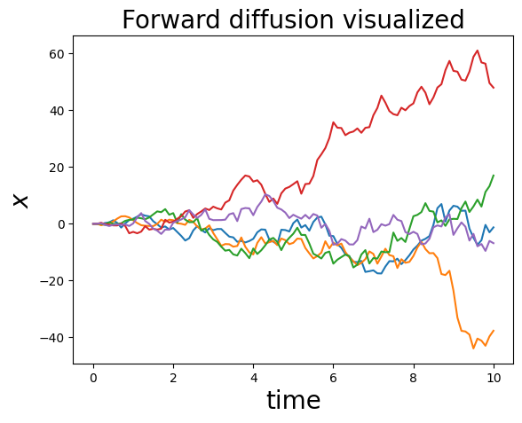
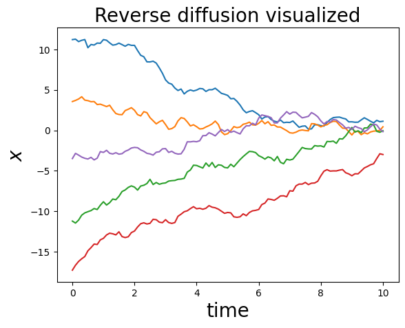

## **扩散模型分成两个步骤**
### *forward diffusion*
下面是一个最简单的扩散等式
$$
\begin{equation}
\begin{split}
x(t + \Delta t) = x(t) + \sigma(t) \sqrt{\Delta t} \ r
\end{split}
\end{equation}
$$
$\sigma(t) > 0$ 是'噪声强度', $\Delta t$ 是步长, $r \sim \mathcal{N}(0, 1)$ 是一个标准的正太随机变量. 我们重复的往我们的sample里面添加正态分布的噪声. 一般噪声强度 $\sigma(t)$ 的选择取决于步长 (i.e. $t$ 越大强度越大）.

下面是一个逆扩散处理:
$$
\begin{equation}
x(t + \Delta t) = x(t) + \sigma(T - t)^2 \frac{d}{dx}\left[ \log p(x, T-t) \right] \Delta t + \sigma(T-t) \sqrt{\Delta t} \ r
\end{equation}
where
\begin{equation}
s(x, t) := \frac{d}{dx} \log p(x, t)
\end{equation}
$$
被称作 **score function**. 通过前面的score function我们可以逆forward diffuion，将噪声反转为原图

如果我们假设 $x_0 = 0$, 噪声强度为常数, score function就是下面的公式
$$
\begin{equation}
s(x, t) = - \frac{(x - x_0)}{\sigma^2 t} = - \frac{x}{\sigma^2 t} \ .
\end{equation}
$$
```python
import numpy as np
import matplotlib.pyplot as plt
# 模拟 forward diffusion N steps.
def forward_diffusion_1D(x0, noise_strength_fn, t0, nsteps, dt):
  """x0: initial sample value, scalar
  noise_strength_fn: function of time, outputs scalar noise strength
  t0: initial time
  nsteps: number of diffusion steps
  dt: time step size
  """

  # Initialize trajectory
  x = np.zeros(nsteps + 1); x[0] = x0
  t = t0 + np.arange(nsteps + 1)*dt 
  
  # Perform many Euler-Maruyama time steps
  for i in range(nsteps):
    noise_strength = noise_strength_fn(t[i])    
    random_normal = np.random.randn()
    x[i+1] = x[i]+ noise_strength*np.sqrt(t[i])*random_normal
  return x, t


# 这里将噪声强度固定为1
def noise_strength_constant(t):
  return 1

nsteps = 100
t0 = 0
dt = 0.1
noise_strength_fn = noise_strength_constant
x0 = 0

num_tries = 5
for i in range(num_tries):
  x, t = forward_diffusion_1D(x0, noise_strength_fn, t0, nsteps, dt)
  
  plt.plot(t, x)
  plt.xlabel('time', fontsize=20)
  plt.ylabel('$x$', fontsize=20)
plt.title('Forward diffusion visualized', fontsize=20)
plt.show()
```

```python
# 模拟 reverse forward diffusion N steps.
def reverse_diffusion_1D(x0, noise_strength_fn, score_fn, T, nsteps, dt):
  """x0: initial sample value, scalar
  noise_strength_fn: function of time, outputs scalar noise strength
  score_fn: score function
  T: final time
  nsteps: number of diffusion steps
  dt: time step size
  """

  # Initialize trajectory
  x = np.zeros(nsteps + 1); x[0] = x0
  t = np.arange(nsteps + 1)*dt 
  
  # Perform many Euler-Maruyama time steps
  for i in range(nsteps):
    noise_strength = noise_strength_fn(T - t[i])
    score = score_fn(x[i], 0, noise_strength, T-t[i])
    random_normal = np.random.randn()
    x[i+1] = x[i] + (noise_strength**2)*score*dt + noise_strength*np.sqrt(dt)*random_normal
  return x, t


def score_simple(x, x0, noise_strength, t):
  score = - (x-x0)/((noise_strength**2)*t)
  return score

nsteps = 100
t0 = 0
dt = 0.1
noise_strength_fn = noise_strength_constant
score_fn = score_simple
x0 = 0
T = 11


num_tries = 5
for i in range(num_tries):
  x0 = np.random.normal(loc=0, scale=T) 
  x, t = reverse_diffusion_1D(x0, noise_strength_fn, score_fn, T, nsteps, dt)
  print(x[-10:])
  
  plt.plot(t, x)
  plt.xlabel('time', fontsize=20)
  plt.ylabel('$x$', fontsize=20)
plt.title('Reverse diffusion visualized', fontsize=20)
plt.show()
```



# **easy_diffusion/ddim**
该路径下实现了DDPM和DDIM论文中提到的扩散步骤，具体内容见easy_diffusion/ddim/diffusion.py中的Diffusion，其中详细交代了如何进行原图扩散的。
其中逆扩散过程实现了两种方式，具体内容见easy_diffusion/ddim/denoising.py一种是DDPM即解SDE，一种是DDIM即解ODE
具体如何使用和训练见ipynb/train_condition_model.ipynb和ipynb/train_uncondition_model_Euler_Maruyama_sampler.ipynb


# **easy_diffusion/sample和easy_diffusion/base_model**
该路径下实现的扩散模型就是类似上面的代码。核心块就是base_model.py中的marginal_prob_std_fn,diffusion_coeff_fn，sample.py中的Euler_Maruyama_sampler
具体如何使用和训练见ipynb/train_condition_model.ipynb和ipynb/train_uncondition_model_Euler_Maruyama_sampler.ipynb


# **easy_diffusion/latent_encoder**
该路径下实现的是autoencoder，就是用来将pixel空间的数据压缩到latent的空间，从而减轻diffusion训练过程内存和显存的压力。
具体如何使用和训练见ipynb/train_latent_encoder_model.ipynb


# **easy_diffusion/predictor**
该路径下实现的是文生动图的代码。实现的步骤就是先通过文生图model，获得original img，然后利用inpainting模型，结合自定义的mask实现镜头平移和远离缩放的效果。
具体如何使用见ipynb/generate_gif.ipynb

